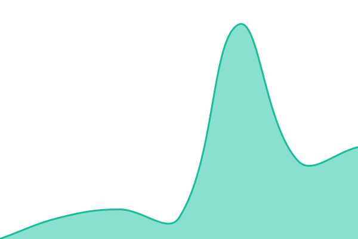
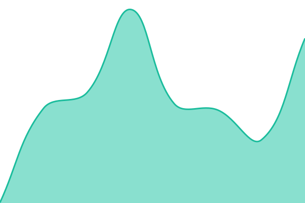
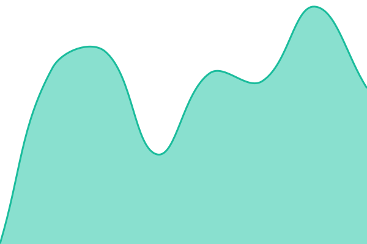
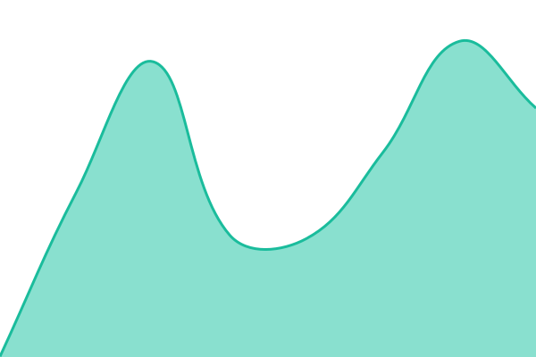

# [📈 Live Status](https://status.goac.io): <!--live status--> **🟩 All systems operational**

This repository contains the open-source uptime monitor and status page for [espressojuice](https://status.goac.io), powered by [Upptime](https://github.com/upptime/upptime).

With [Upptime](https://upptime.js.org), you can get your own unlimited and free uptime monitor and status page, powered entirely by a GitHub repository. We use [Issues](https://github.com/espressojuice/goac-status/issues) as incident reports, [Actions](https://github.com/espressojuice/goac-status/actions) as uptime monitors, and [Pages](https://status.goac.io) for the status page.

<!--start: status pages-->
<!-- This summary is generated by Upptime (https://github.com/upptime/upptime) -->
<!-- Do not edit this manually, your changes will be overwritten -->
<!-- prettier-ignore -->
| URL | Status | History | Response Time | Uptime |
| --- | ------ | ------- | ------------- | ------ |
|  [GOAC Dashboard](https://app.goac.io) | 🟩 Up | [goac-dashboard.yml](https://github.com/espressojuice/goac-status/commits/HEAD/history/goac-dashboard.yml) | 

 408ms
     
 | 

<a href="https://status.goac.io/history/goac-dashboard">100.00%</a>
    

|  [Platform API](https://api.goac.io/health) | 🟩 Up | [platform-api.yml](https://github.com/espressojuice/goac-status/commits/HEAD/history/platform-api.yml) | 

 209ms
     
 | 

<a href="https://status.goac.io/history/platform-api">100.00%</a>
    

|  [Documenso (e-signature)](https://sign.goac.io) | 🟩 Up | [documenso-e-signature.yml](https://github.com/espressojuice/goac-status/commits/HEAD/history/documenso-e-signature.yml) | 

 428ms
     
 | 

<a href="https://status.goac.io/history/documenso-e-signature">100.00%</a>
    

|  [Monitoring (Uptime Kuma)](https://monitor.goac.io) | 🟩 Up | [monitoring-uptime-kuma.yml](https://github.com/espressojuice/goac-status/commits/HEAD/history/monitoring-uptime-kuma.yml) | 

 465ms
     
 | 

<a href="https://status.goac.io/history/monitoring-uptime-kuma">100.00%</a>
    

<!--end: status pages-->

[**Visit our status website →**](https://status.goac.io)

## 📄 License

- Powered by: [Upptime](https://github.com/upptime/upptime)
- Code: [MIT](./LICENSE) © [Anand Chowdhary](https://anandchowdhary.com)
- Data in the `./history` directory: [Open Database License](https://opendatacommons.org/licenses/odbl/1-0/)
